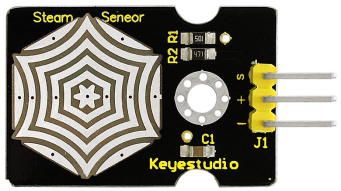
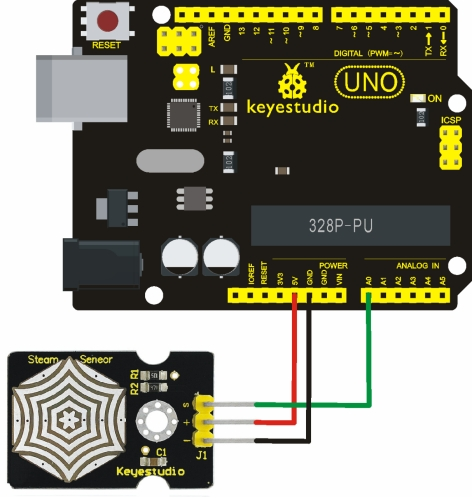
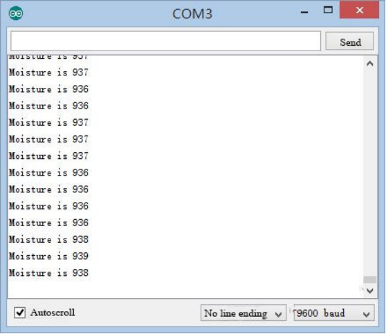

# KS0203 keyestudio Steam Sensor



## 1. Introduction

Steam sensor is an analog sensor and can be made as a simple rainwater detector and liquid level switch. When humidity on the face of this sensor rises, output voltage will increase.

**Caution:** connection parts is non-waterproof, so please don’t put them into water.

## 2. Performance Parameters

- Working Voltage: 3.3V or 5V
- Working Current: <20mA
- Range of Working Temperature: －10℃～＋70℃
- Interface Type: Analog Signal Output

**Pin Definition：**

- **S：**Signal Output
- **+：**Power Supply(VCC)
- **-：**Ground(GND)

## 3. Connection Diagram



## 4. Code

Download code:  [Code](./Code.7z)

```c
void setup()
{
	Serial.begin(9600); //open serial port, and set baud rate at 9600bps
}

void loop()
{
    int val;
    val=analogRead(0); //plug vapor sensor into analog port 0
    Serial.print("Moisture is ");
    Serial.println(val,DEC); //read analog value through serial port printed
    delay(100);
}
```

## 5. Result

When detecting different degrees of humidity, the sensor will get the feedback of different current value. Shown as the following picture，the value is displayed on serial port when the sensor detects the steam of boiled water.

